Это приложение можно использовать для формирования и контроля списка предстоящих задач.

Главная страница
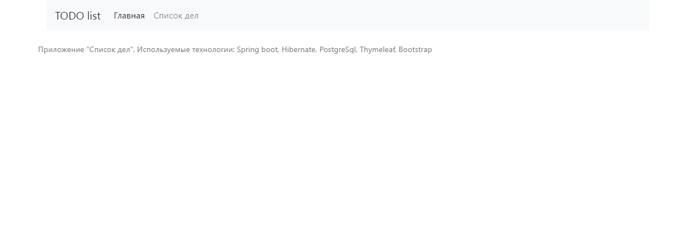
При переходе по ссылке "Список дел" неавторизованный пользователь попадает 
на страницу авторизации, где он может зарегистрироваться
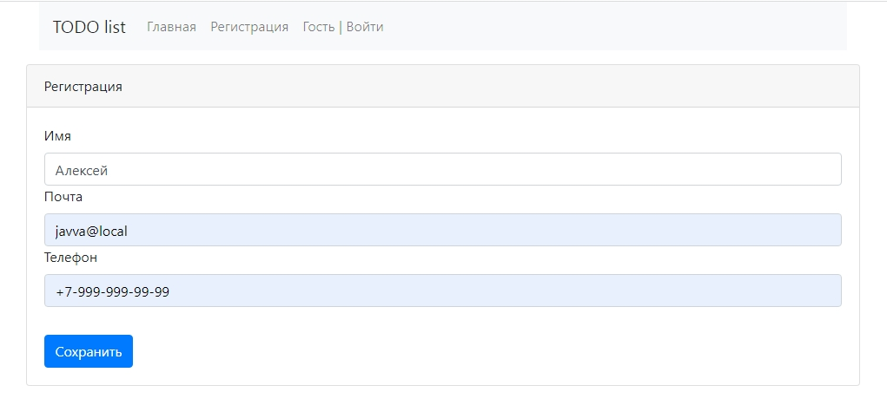
Если регистрация прошла успешно, пользователь видит сообщение, 
подтверждающее регистрацию и предлагающее авторизоваться.
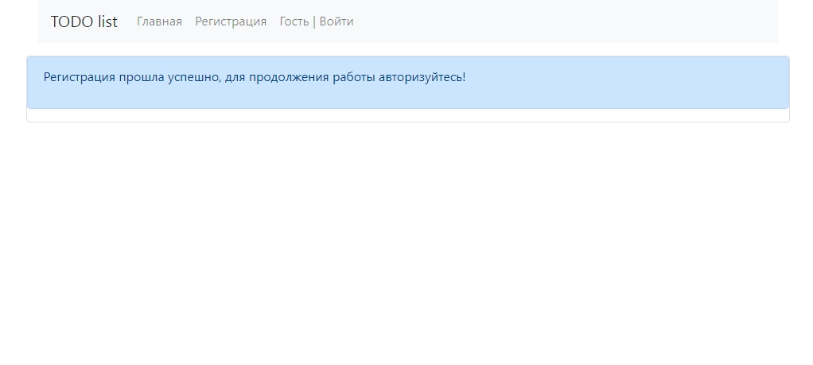
Если пользователь с такой почтой уже зарегистрирован, то пользователь 
также получит сообщение о том, что регистрация не подтверждена.
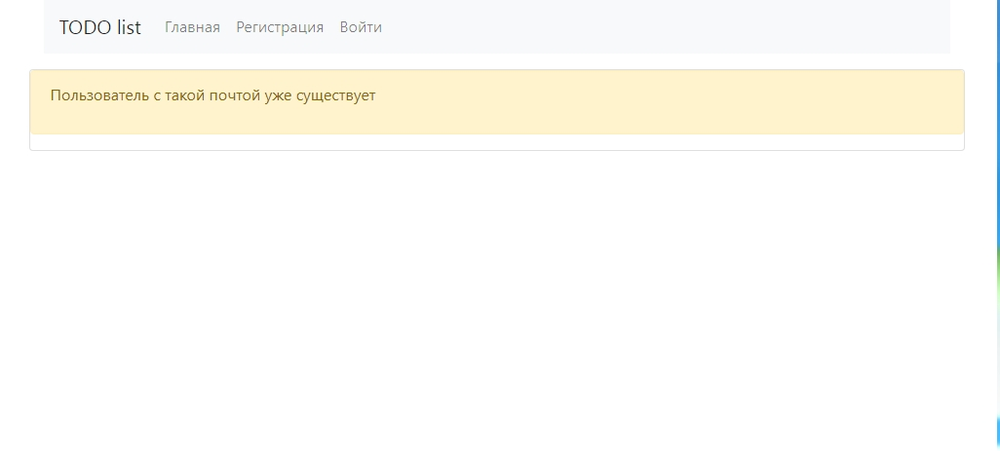
Если пользователь уже зарегистрирован в системе, то по ссылке "Войти"
он попадает на страницу авторизации
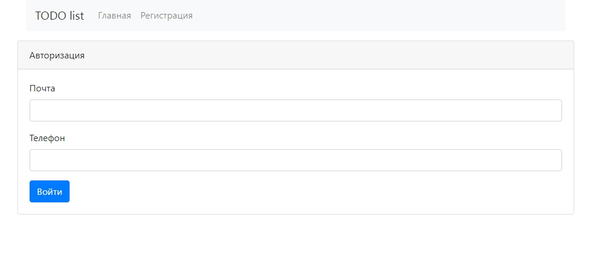
Где вводит свои регистрационные данные
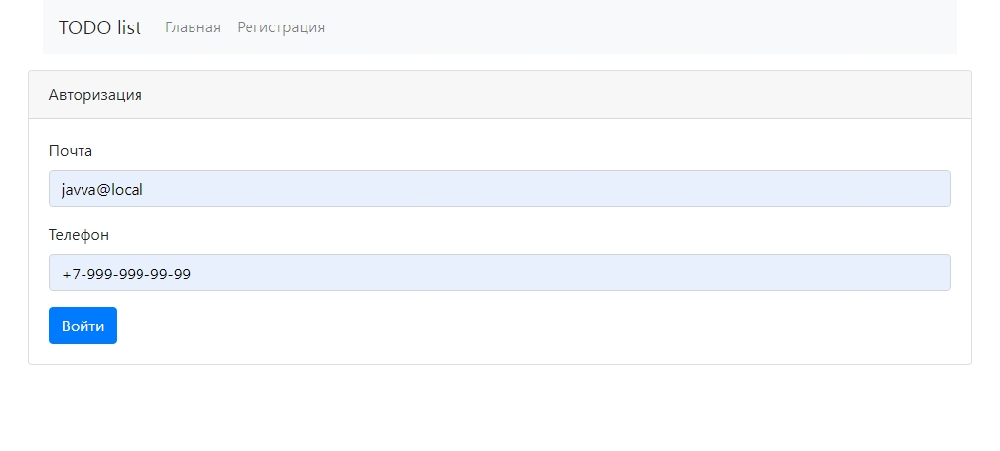
Если регистрационные данные введены неверно, пользователь получит 
соответствующее сообщение
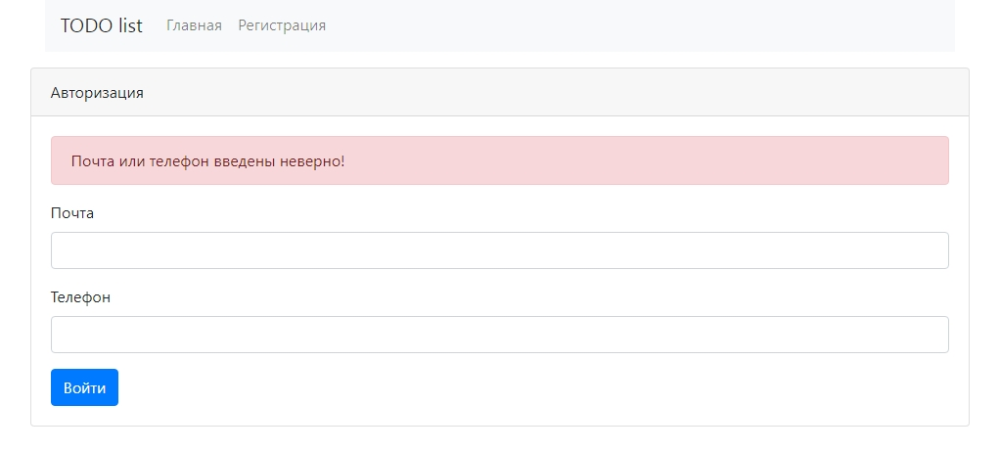
После успешной авторизации пользователь попадает на страницу со своими заданиями. 
Так как пользователь только зарегистрировался, то список его заданий еще пустой.
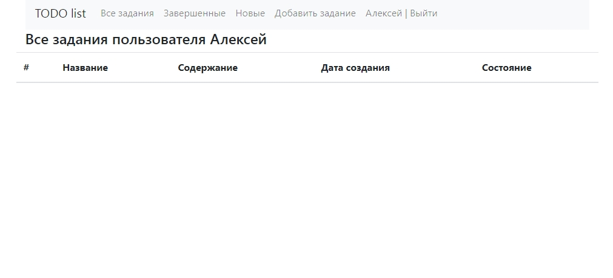
По ссылке "Добавить задание" пользователь может разместить задачу в системе
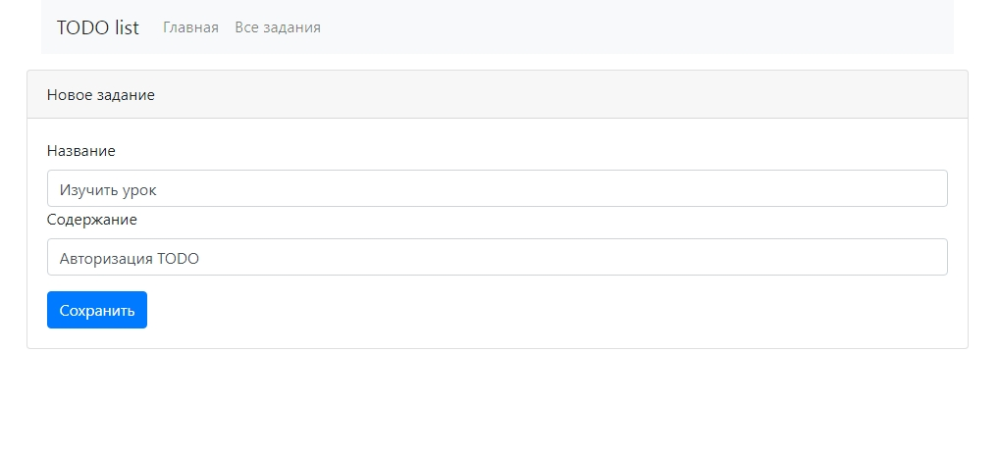
При наличии заданий список всех задач пользователя выглядит таким образом:
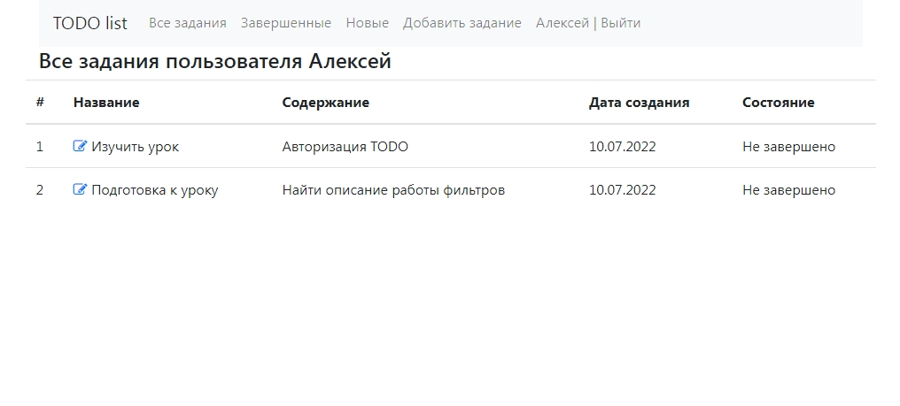
Пользователь может завершить, изменить или удалить задание
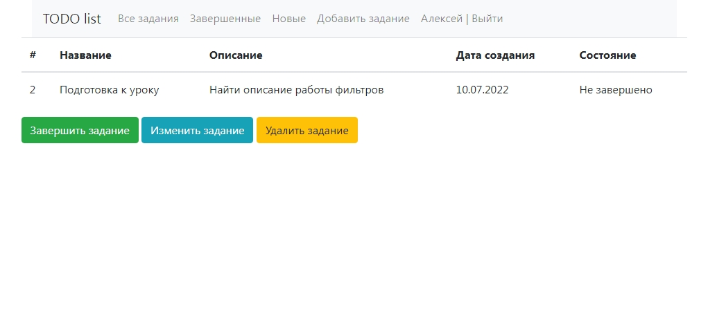
Пользователь может отредактировать задание
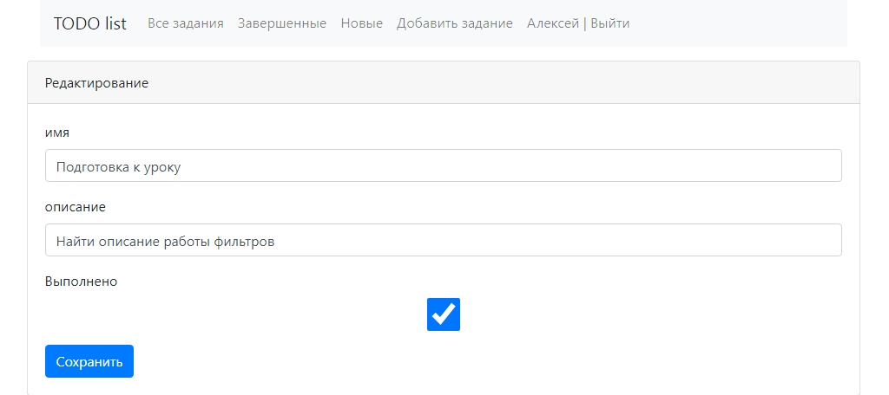
Все неудаленные доступны по ссылке "Все задания"
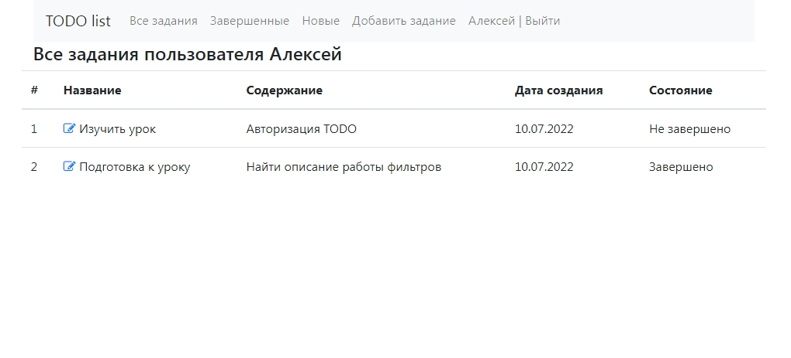
Все завершенные задания доступны по ссылке "Завершенные"
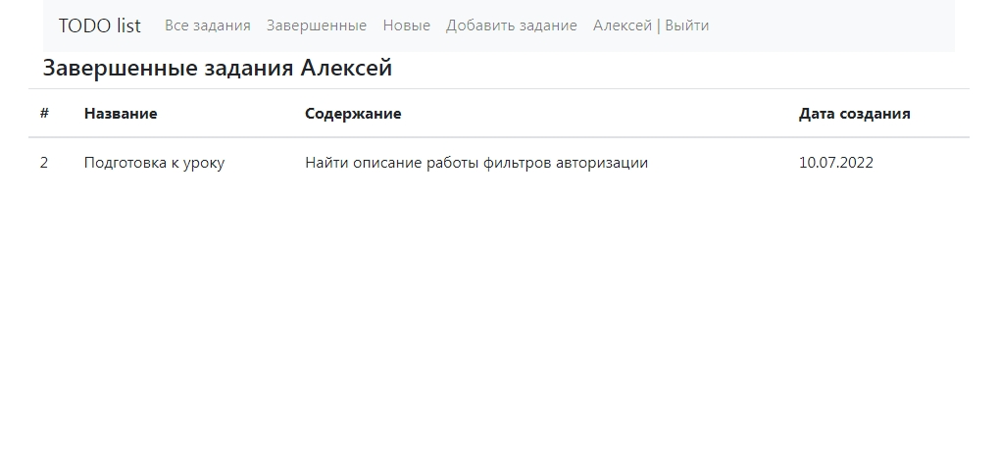
Все незавершенные задания доступны по ссылке "Новые"
