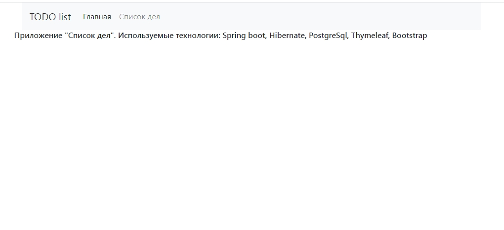
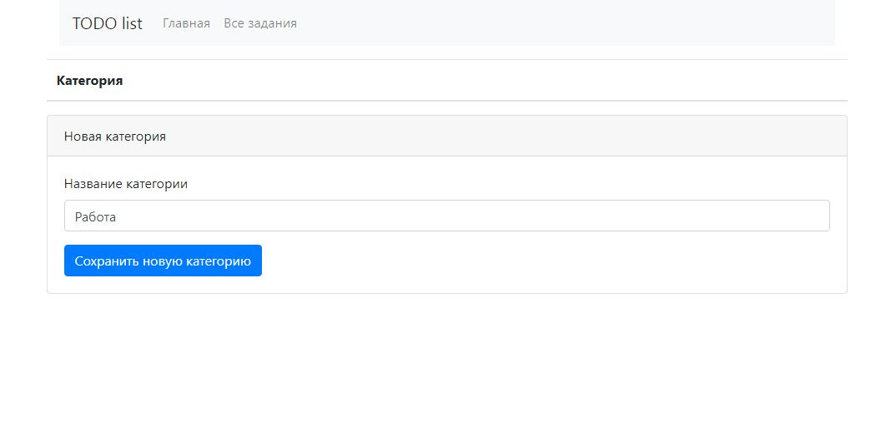

Это приложение можно использовать для формирования и контроля списка предстоящих задач.

Главная страница

При переходе по ссылке "Список дел" неавторизованный пользователь попадает 
на страницу авторизации, где он может зарегистрироваться

Если регистрация прошла успешно, пользователь видит сообщение, 
подтверждающее регистрацию и предлагающее авторизоваться.

Если пользователь с такой почтой уже зарегистрирован, то пользователь 
также получит сообщение о том, что регистрация не подтверждена.

Если пользователь уже зарегистрирован в системе, то по ссылке "Войти"
он попадает на страницу авторизации

Где вводит свои регистрационные данные

Если регистрационные данные введены неверно, пользователь получит 
соответствующее сообщение

После успешной авторизации пользователь попадает на страницу со своими заданиями. 
Так как пользователь только зарегистрировался, то список его заданий еще пустой.

По ссылке "Категории" надо добавить нужные категории

Добавляем категорию "Работа"

Добавляем несколько категорий

Когда категории заполнены, можно приступать к заполнению нового задания
По ссылке "Добавить задание" пользователь может разместить задачу в системе

Первая задача успешно размещена

Задача может одновременно относиться к нескольким категориям

Сейчас список всех задач пользователя выглядит таким образом:

Незавершенную задачу можно удалить, изменить или завершить

Все задания отображаются по ссылке "Все задания"

Завершенные задания отображаются по ссылке "Завершенные"

Незавершенные задания отображаются по ссылке "Новые"

Завершенное задание из списка можно только удалить

В незавершенном задании можно изменить любую информацию, кроме его номера

Как видим, изменить возможно все, включая категории задания

Как видим, номер задания остается прежним, а вся информация теперь заменена.
